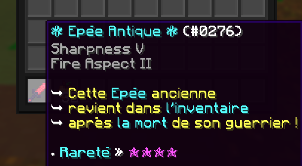

# Infinites Items ♾️

[](https://www.spigotmc.org/)

Create an infinity of fully customizable minecraft items which can respawn after your death !


## Screenshots 🔍



## Preview 🎥

[](https://youtu.be/YxzikJbgdWI)

## How to use it ✨

download the zip file, go into the Target directory and put the .jar into your plugins.

Then in game, write /farm to open the ranking menu, or /farmpoint to see how to set / add points to a faction
```bash
  /infiniteitems
```

## Author 💻

- Ayato__#0069
